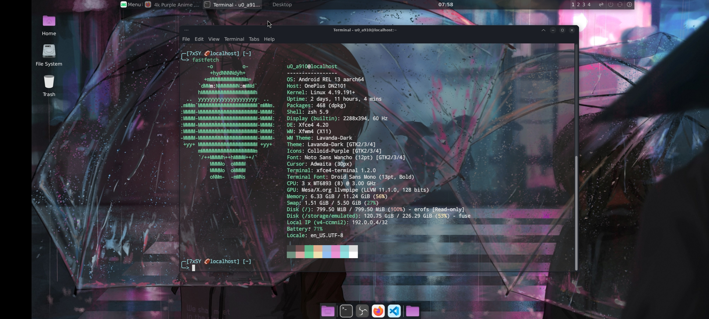
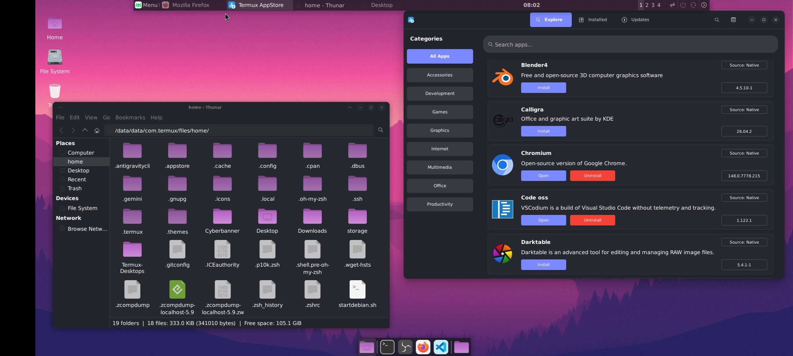
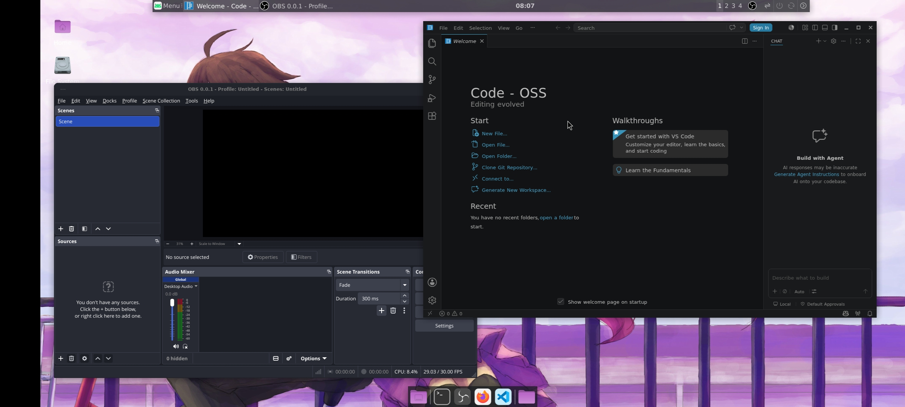

# 🖥️ Termux Native Desktop

> Run a full XFCE4 desktop directly in Termux — no proot, no root required.  
> Status: ✅ Complete · XFCE: **4.20**

---

## Preview

| fastfetch | AppStore + Thunar | Code OSS + OBS |
|---|---|---|
|  |  |  |

**Specs (tested on):**
- Device: OnePlus DN2101
- CPU: MT6893 (8) @ 3.00 GHz
- GPU: Mesa/X.org llvmpipe (software rendering)
- OS: Android REL 13 aarch64
- Kernel: Linux 4.19.191+
- Shell: zsh 5.9 · DE: Xfce4 4.20 · WM: Xfwm4
- Theme: Lavanda-Dark · Icons: Colloid-Purple

---

## Native vs proot — which should I use?

| | Native Termux | proot Distro |
|---|:---:|:---:|
| Root required | ❌ | ❌ |
| Full Linux distro | ❌ | ✅ |
| Package manager | `pkg` | `apt/dnf/pacman` |
| VirGL GPU accel | ❌ | ✅ |
| GPU (Adreno) | ✅ Zink/Turnip | ✅ VirGL |
| GPU (Mali) | ⚠️ llvmpipe | ✅ VirGL |
| Performance | 🚀 Fast | ⚡ Good |
| Storage usage | 💚 Low | 🟡 Higher |

> **Mali users:** Native Termux uses software rendering (llvmpipe). For hardware acceleration use a proot distro instead.  
> **Adreno users:** Native Termux can use Zink+Turnip for hardware acceleration.

---

## Step 1 — Required Packages

```bash
pkg update && pkg upgrade -y

pkg install x11-repo
pkg install termux-x11-nightly
pkg install tur-repo
pkg install pulseaudio
pkg install git wget
```

---

## Step 2 — Install XFCE4 Desktop

```bash
pkg install xfce4 xfce4-terminal xfce4-goodies xorg-xhost -y
```

> ⚠️ If you get a `cursor:arm64` conflict error, fix it with:
> ```bash
> sed -i 's/Status: deinstall ok half-installed/Status: deinstall ok config-files/' \
>   /data/data/com.termux/files/usr/var/lib/dpkg/status
> sed -i '/^Package: cursor$/,/^$/d' \
>   /data/data/com.termux/files/usr/var/lib/dpkg/status
> dpkg --configure -a
> pkg install xfce4 xfce4-terminal xfce4-goodies xorg-xhost -y
> ```

---

## Step 3 — Install Apps

### Firefox
```bash
pkg install firefox -y
```

### Code OSS (VS Code open source)
```bash
pkg install code-oss -y
```

### Fastfetch
```bash
pkg install fastfetch -y
```

### OBS Studio
```bash
pkg install obs -y
```

---

## Step 4 — Launch Script

> Download directly from the repo:

```bash
wget https://raw.githubusercontent.com/ryuV2/Termux-Desktops/main/scripts/startdesktop.sh \
  -O ~/startdesktop.sh
chmod +x ~/startdesktop.sh
```

Launch:

```bash
bash ~/startdesktop.sh
```

---

## Step 5 — Termux AppStore (Optional but Recommended)

The Termux AppStore gives you a **graphical app installer** — browse and install apps without typing commands.

### Install dependencies

```bash
pkg install python python-pip gtk3 gobject-introspection -y
```

### Download and install

Go to: **https://github.com/sabamdarif/Termux-AppStore/releases**

Download the latest `termux-appstore_*_aarch64.deb` then:

```bash
cd ~/storage/shared/Download
dpkg -i termux-appstore_*.deb
pkg install -f -y
```

### Launch from desktop terminal

```bash
DISPLAY=:0 termux-appstore &
```

> ℹ️ The warning `"Termux desktop config not found. Distro support disabled"` is normal — proot distro management is disabled but all native Termux apps work perfectly.

---

## Step 6 — Theming (Optional)

### Install themes

```bash
pkg install papirus-icon-theme -y
```

For GTK themes, download from **https://www.xfce-look.org** and extract to `~/.themes/`

For icon packs, extract to `~/.icons/`

Apply via **XFCE4 → Applications → Settings → Appearance**

---

## GPU Notes

| Device | GPU | Acceleration |
|---|---|:---:|
| Snapdragon (Adreno) | Adreno | ✅ Zink + Turnip |
| Dimensity/Exynos (Mali) | Mali | ⚠️ llvmpipe (fallback) |
| Other | Varies | ⚠️ Depends |

For Mali devices wanting GPU acceleration → use a **proot distro** with VirGL instead.  
See: [Hardware Acceleration Guide](hardware-acceleration.md)

---

## Troubleshooting

| Issue | Fix |
|---|---|
| `startxfce4: command not found` | `pkg install xfce4 -y` |
| `cursor:arm64` dpkg conflict | See Step 2 fix above |
| Black screen | Make sure Termux:X11 app is open |
| AppStore won't open | Run `DISPLAY=:0 termux-appstore &` from terminal |
| llvmpipe instead of GPU | Expected on Mali — use proot for VirGL |

---

<div align="right"><a href="../README.md">← back to index</a></div>
