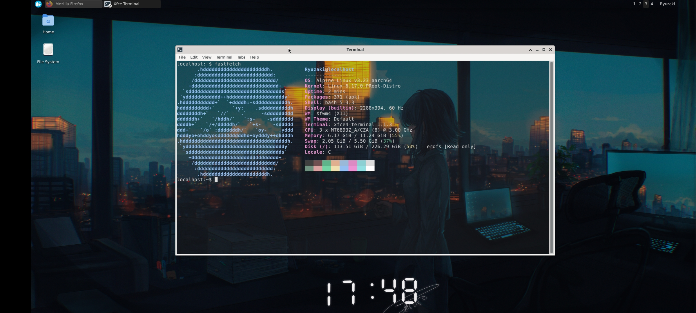
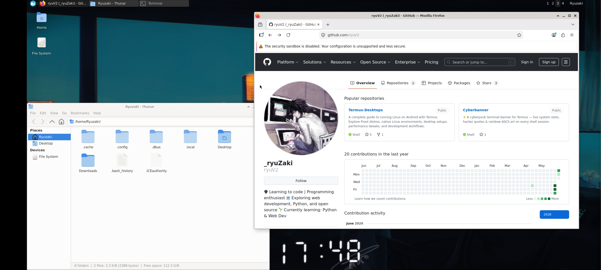

# Alpine Linux v3.23 — proot Desktop

> Full XFCE4 desktop with VirGL hardware acceleration on Android — no root required.  
> Status: ✅ Complete · XFCE: **4.20** · glmark2: **67**

---

## Preview

| fastfetch | Desktop + Firefox + Thunar |
|---|---|
|  |  |

**Specs (tested on):**
- Device: OnePlus Nord 2 5G
- CPU: MT6893Z_A/CZA (8) @ 3.00 GHz
- GPU: Mesa virgl (Mali-G77 MC9)
- OS: Alpine Linux v3.23 aarch64
- Kernel: 6.17.0-PRooT-Distro
- Shell: bash 5.3.3 · WM: Xfwm4 (X11)
- Packages: 371 (apk)

---

## Requirements

- Termux (F-Droid or GitHub — NOT Play Store)
- Termux:X11 APK from GitHub releases
- ~2 GB free storage (Alpine is very lightweight)

---

## Step 1 — Termux Packages

**Mali / MediaTek / Exynos devices:**
```bash
pkg update && pkg upgrade -y
pkg install x11-repo termux-x11-nightly proot-distro pulseaudio virglrenderer-android
```

**Snapdragon / Adreno devices:**
```bash
pkg update && pkg upgrade -y
pkg install x11-repo termux-x11-nightly proot-distro pulseaudio \
  mesa-zink vulkan-loader-android virglrenderer-mesa-zink
```

---

## Step 2 — Install Alpine

```bash
proot-distro install alpine
proot-distro login alpine
```

---

## Step 3 — Update System

```bash
apk update && apk upgrade
```

---

## Step 4 — Fix PATH (Important)

Alpine's `/sbin` is not in PATH by default for regular users. Fix it permanently:

```bash
echo 'export PATH=$PATH:/sbin' >> ~/.bashrc
source ~/.bashrc
```

> Without this, commands like `apk` won't work from user sessions.

---

## Step 5 — Install XFCE4 + Apps

```bash
apk add xfce4 xfce4-terminal xfce4-screenshooter \
  xfce4-whiskermenu-plugin xfce4-notifyd xfce4-appfinder \
  xfce4-settings xfdesktop xfwm4 \
  thunar dbus-x11 pulseaudio pulseaudio-alsa \
  mesa-dri-gallium mesa-gl mesa-utils \
  bash sudo nano wget curl git fastfetch \
  adwaita-icon-theme hicolor-icon-theme \
  xdg-utils glib garcon
```

---

## Step 6 — Set Root Password

```bash
passwd
# set a password you'll remember — needed for su - on desktop
```

---

## Step 7 — Create a Non-Root User

```bash
adduser -h /home/YourUsername -s /bin/bash YourUsername
addgroup YourUsername wheel
echo "%wheel ALL=(ALL) NOPASSWD:ALL" >> /etc/sudoers
```

---

## Step 8 — Fix su (Critical for Alpine)

Alpine's `su` requires the suid bit to work properly in proot:

```bash
chmod u+s /bin/su
```

> Without this, `su - YourUsername` will fail with `su: must be suid to work properly`.

---

## Step 9 — Install Firefox

```bash
apk add firefox
```

> ⚠️ Firefox tabs crash in proot by default. Always launch Firefox with:
> ```bash
> MOZ_DISABLE_CONTENT_SANDBOX=1 MOZ_WEBRENDER=0 firefox
> ```

Create a fixed desktop entry so it launches correctly from the menu:

```bash
cat > /usr/share/applications/firefox.desktop << 'EOF'
[Desktop Entry]
Name=Firefox
Exec=env MOZ_DISABLE_CONTENT_SANDBOX=1 MOZ_WEBRENDER=0 firefox %u
Icon=firefox
Type=Application
Categories=Network;WebBrowser;
EOF
update-desktop-database /usr/share/applications
```

---

## Step 10 — Enable Edge Repos (for glmark2 + extra packages)

```bash
echo "https://dl-cdn.alpinelinux.org/alpine/edge/testing" >> /etc/apk/repositories
echo "https://dl-cdn.alpinelinux.org/alpine/edge/community" >> /etc/apk/repositories
apk update
apk add glmark2
```

---

## Step 11 — Exit and Download Launch Script

> ⚠️ Run in **Termux**, not inside proot.

```bash
exit
```

### Mali / MediaTek / Exynos (VirGL)

```bash
wget https://raw.githubusercontent.com/DeadKnox/Termux-Desktops/main/scripts/startalpine.sh \
  -O ~/startalpine.sh
chmod +x ~/startalpine.sh
```

### Snapdragon / Adreno (Zink + Turnip)

```bash
wget https://raw.githubusercontent.com/DeadKnox/Termux-Desktops/main/scripts/startalpine-adreno.sh \
  -O ~/startalpine.sh
chmod +x ~/startalpine.sh
```

> **Adreno 6XX/7XX users:** Install Turnip inside proot first:
> ```bash
> wget https://github.com/K11MCH1/AdrenoToolsDrivers/releases/download/v24.1.0/mesa-vulkan-kgsl_24.1.0-devel-20240120_arm64.deb
> # Extract and install manually
> ```

**Edit your username:**
```bash
nano ~/startalpine.sh
# Replace YourUsername with your actual username
# Save: Ctrl+X → Y → Enter
```

**Launch:**
```bash
bash ~/startalpine.sh
```

---

## ⚠️ Known Issues & Workarounds

### Whisker Menu / AppFinder shows no applications
This is a D-Bus system bus limitation in Alpine proot. The menu categories are empty but the **search bar still works** — type the app name directly to launch it.

### sudo doesn't work
Use `su -` instead:
```bash
su -
# enter root password
apk add whatever-you-need
exit
```

### glxinfo crashes
This is a known Alpine Mesa bug. Use `glxgears` to verify OpenGL works instead:
```bash
glxgears
# Should run at ~240+ FPS with VirGL active
```

### apk: command not found (in user session)
```bash
export PATH=$PATH:/sbin
```

### Firefox tabs crash
Always launch with:
```bash
MOZ_DISABLE_CONTENT_SANDBOX=1 MOZ_WEBRENDER=0 firefox
```

---

## GPU Support

| GPU | Method | Status |
|---|---|:---:|
| Mali (MediaTek / Exynos) | VirGL (virpipe) | ✅ Works |
| Adreno 6XX/7XX (Snapdragon) | Zink + Turnip | ✅ Works |

---

## Benchmark

```
Device  : OnePlus Nord 2 5G
GPU     : Mali-G77 MC9
Driver  : Mesa virgl (GALLIUM_DRIVER=virpipe)
Mesa    : 25.2.7

glmark2 Score: 67
glxgears    : ~240 FPS
```

---

<div align="right"><a href="../../README.md">← back to index</a></div>
