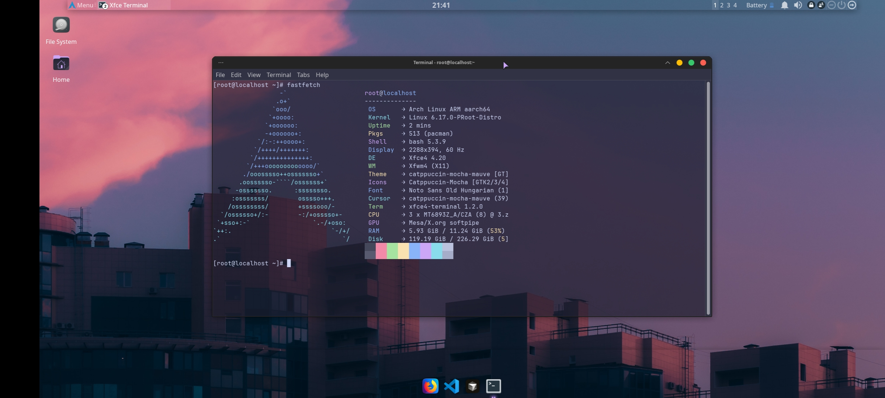

# Arch Linux ARM — proot Desktop

> Full XFCE4 desktop with VirGL hardware acceleration on Android — no root required.  
> Status: ✅ Complete · XFCE: **4.20**

---

## Preview

| fastfetch |
|---|
|  |

**Specs (tested on):**
- Device: OnePlus Nord 2 5G
- CPU: MT6893Z_A/CZA (8) @ 3.00 GHz
- GPU: Mesa/X.org softpipe → virpipe with VirGL
- OS: Arch Linux ARM aarch64
- Kernel: 6.17.0-PRooT-Distro
- Shell: bash 5.3.9 · DE: Xfce4 4.20 · WM: Xfwm4
- Theme: catppuccin-mocha-mauve · Icons: Catppuccin-Mocha

---

## ⚠️ Important — proot-distro v5 Warning

The standard `proot-distro install archlinux` command **does not work on ARM** in v5 — it silently pulls an amd64-only image. You **must** use the `menci/archlinuxarm` image instead.

---

## Requirements

- Termux (F-Droid or GitHub — NOT Play Store)
- Termux:X11 APK from GitHub releases
- ~3–4 GB free storage

---

## Step 1 — Termux Packages

**Mali / MediaTek / Exynos devices:**
```bash
pkg update && pkg upgrade -y
pkg install x11-repo termux-x11-nightly proot-distro pulseaudio virglrenderer-android
```

**Snapdragon / Adreno devices:**
```bash
pkg update && pkg upgrade -y
pkg install x11-repo termux-x11-nightly proot-distro pulseaudio \
  mesa-zink vulkan-loader-android virglrenderer-mesa-zink
```

---

## Step 2 — Install Arch Linux ARM

```bash
proot-distro install menci/archlinuxarm --override-alias archlinux
```

---

## Step 3 — Fix Entrypoint Shell (Critical)

The image uses `/bin/zsh` as its default shell — which isn't installed yet. Fix it from Termux **before** logging in:

```bash
sed -i 's|/bin/zsh|/bin/bash|g' \
  /data/data/com.termux/files/usr/var/lib/proot-distro/containers/archlinux/rootfs/etc/passwd
```

Verify:
```bash
grep root /data/data/com.termux/files/usr/var/lib/proot-distro/containers/archlinux/rootfs/etc/passwd
# Should show: root:x:0:0::/root:/bin/bash
```

Now login:
```bash
proot-distro login archlinux
```

---

## Step 4 — Fix Pacman Sandbox (Critical)

Inside Arch, disable the sandbox to prevent pacman from hanging:

```bash
sed -i 's/#DisableSandboxFilesystem/DisableSandboxFilesystem/' /etc/pacman.conf
sed -i 's/#DisableSandboxSyscalls/DisableSandboxSyscalls/' /etc/pacman.conf
```

---

## Step 5 — Update and Install Desktop

```bash
pacman -Syu
pacman -S sudo vim nano git wget tar base-devel fakeroot
pacman -S xfce4 xfce4-goodies pulseaudio noto-fonts openssh
pacman -S libxss nss libcups gtk3 libxkbfile xdg-utils alsa-lib curl
```

> ⚠️ "Protocol driver not attached" warnings during pacman are normal in proot — ignore them.

---

## Step 6 — Set Root Password

```bash
passwd
# set a password you'll remember — needed for su - on desktop
```

---

## Step 7 — Create a Non-Root User

```bash
useradd -m -G wheel -s /bin/bash YourUsername
echo "YourUsername:YourPassword" | chpasswd
echo "%wheel ALL=(ALL) NOPASSWD:ALL" >> /etc/sudoers
```

Exit:
```bash
exit
```

---

## Step 8 — Launch Script

> ⚠️ Run in **Termux**, not inside proot.

### Mali / MediaTek / Exynos (VirGL)

```bash
wget https://raw.githubusercontent.com/DeadKnox/Termux-Desktop/main/scripts/startarch.sh \
  -O ~/startarch.sh
chmod +x ~/startarch.sh
```

### Snapdragon / Adreno (Zink + Turnip)

```bash
wget https://raw.githubusercontent.com/DeadKnox/Termux-Desktop/main/scripts/startarch-adreno.sh \
  -O ~/startarch.sh
chmod +x ~/startarch.sh
```

> **Adreno 6XX/7XX users:** Install Turnip inside proot first:
> ```bash
> wget https://github.com/K11MCH1/AdrenoToolsDrivers/releases/download/v24.1.0/mesa-vulkan-kgsl_24.1.0-devel-20240120_arm64.deb
> pacman -U mesa-vulkan-kgsl_*.deb
> ```

**Edit your username:**
```bash
nano ~/startarch.sh
# Replace YourUsername with your actual username
# Save: Ctrl+X → Y → Enter
```

**Launch:**
```bash
bash ~/startarch.sh
```

---

## Installing Apps

### Cursor AI IDE
```bash
# Download Linux .deb (ARM64) from https://cursor.com/download, then:
cd ~/Downloads
ar x cursor_*.deb
tar xf data.tar.xz -C /
/usr/share/cursor/cursor --no-sandbox
```

### Blender + OBS Studio
```bash
pacman -S blender obs-studio
```

### Terminal tools
```bash
pacman -S fastfetch htop cmatrix
```

---

## ⚠️ Installing Packages on Desktop

`sudo` doesn't work in proot. Use `su -` from the desktop terminal:

```bash
su -
# enter root password
pacman -S whatever-you-need
exit
```

---

## GPU Support

| GPU | Method | Status |
|---|---|:---:|
| Mali (MediaTek / Exynos) | VirGL (virpipe) | ✅ Works |
| Adreno 6XX/7XX (Snapdragon) | Zink + Turnip | ✅ Works |
| Adreno (older) | VirGL fallback | ⚠️ May work |
| PowerVR | — | ⚠️ Untested |

> Never use Turnip on Mali devices — it will crash.

---

## Troubleshooting

| Issue | Fix |
|---|---|
| `shell '/bin/zsh' is not available` | Run the Step 3 sed fix from Termux host |
| `X server already running` | Script cleans lock files automatically |
| `pacman -S` hangs | Run Step 4 pacman sandbox fix |
| `.deb arm64 architecture mismatch` | Use `ar x` to extract manually |
| D-Bus popup errors in apps | Harmless — dismiss and continue |
| `sudo` doesn't work | Use `su -` instead |

---

<div align="right"><a href="../../README.md">← back to index</a></div>
