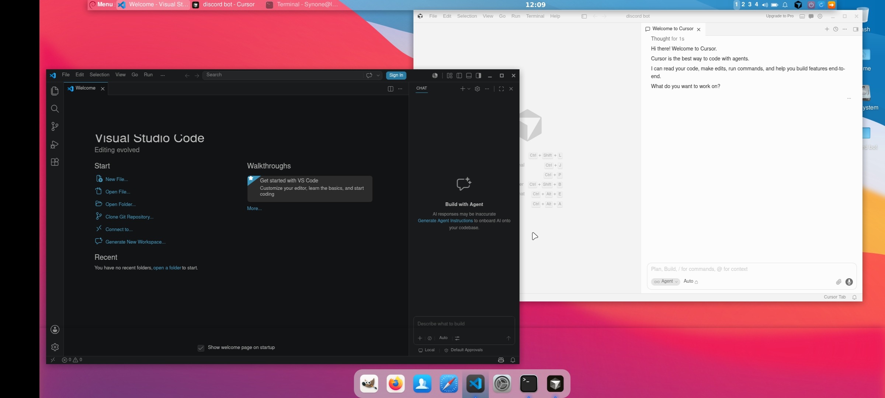
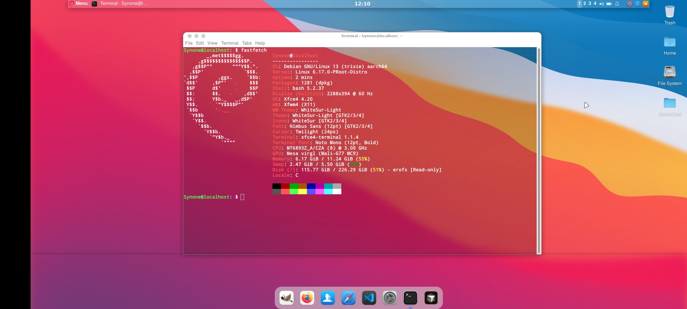

# Debian Trixie — proot Desktop

> Full XFCE4 desktop with VirGL hardware acceleration on Android — no root required.  
> Status: ✅ Complete · glmark2: **62** · XFCE: **4.20**

---

## Preview

| Cursor AI + Discord Bot | fastfetch |
|---|---|
|  |  |

**Specs (tested on):**
- Device: OnePlus Nord 2 5G
- CPU: MT6893Z_A/CZA (8) @ 3.00 GHz
- GPU: Mesa virgl (Mali-G77 MC9)
- OS: Debian GNU/Linux 13 (trixie) aarch64
- Kernel: 6.17.0-PRooT-Distro
- Shell: bash 5.2.37 · DE: Xfce4 4.20 · WM: Xfwm4
- Theme: WhiteSur-Light · Icons: WhiteSur

---

## Requirements

- Termux (from F-Droid or GitHub — NOT Play Store)
- Termux:X11 APK from GitHub releases
- ~3–4 GB free storage

---

## Step 1 — Termux Packages

**Mali / MediaTek / Exynos devices:**
```bash
pkg update && pkg upgrade -y
pkg install x11-repo termux-x11-nightly proot-distro pulseaudio virglrenderer-android
```

**Snapdragon / Adreno devices:**
```bash
pkg update && pkg upgrade -y
pkg install x11-repo termux-x11-nightly proot-distro pulseaudio \
  mesa-zink vulkan-loader-android virglrenderer-mesa-zink
```

---

## Step 2 — Install Debian

```bash
proot-distro install debian
```

Login as root:

```bash
proot-distro login debian
```

---

## Step 3 — Initial Setup

```bash
apt update && apt upgrade -y
apt install sudo adduser wget curl git nano -y
```

### Create a non-root user

```bash
adduser YourUsername
usermod -aG sudo YourUsername
```

> Replace `YourUsername` with whatever username you want.

Exit and log back in as your user:

```bash
exit
proot-distro login debian --user YourUsername
```

---

## Step 4 — Install XFCE4 Desktop

```bash
sudo apt install xfce4 xfce4-terminal xfce4-goodies \
  dbus-x11 xorg pulseaudio pavucontrol -y
```

---

## Step 5 — Enable VirGL (Hardware Acceleration)

```bash
sudo apt install mesa-utils libgl1-mesa-dri -y
```

> The VirGL server runs from Termux side — it's handled in the launch script below.

Verify after desktop starts:

```bash
glxinfo | grep "OpenGL renderer"
# Expected: virgl (Mali-G77) or similar
```

Or run a benchmark:

```bash
sudo apt install glmark2 -y
glmark2
```

---

## Step 6 — Install Firefox ESR

```bash
sudo apt install firefox-esr -y
xdg-settings set default-web-browser firefox-esr.desktop
```

---

## Step 7 — Theming (WhiteSur)

Install WhiteSur GTK theme + icons:

```bash
sudo apt install git -y

# GTK Theme
git clone https://github.com/vinceliuice/WhiteSur-gtk-theme.git
cd WhiteSur-gtk-theme && ./install.sh
cd ..

# Icons
git clone https://github.com/vinceliuice/WhiteSur-icon-theme.git
cd WhiteSur-icon-theme && ./install.sh
cd ..
```

Apply via **XFCE4 Appearance Settings** → select WhiteSur-Light / WhiteSur icons.

Other tested themes:

| Theme | Style |
|---|---|
| WhiteSur-Light | macOS-like, clean |
| Lavanda-Dark-Compact-Tokyonight | Dark, cyberpunk |
| Colloid-Dark | Flat, modern |

---

## Step 8 — Add Kali Repo (Cybersecurity Tools)

```bash
echo "deb http://http.kali.org/kali kali-rolling main contrib non-free non-free-firmware" \
  | sudo tee /etc/apt/sources.list.d/kali.list

wget -q -O - https://archive.kali.org/archive-key.asc | sudo apt-key add -
sudo apt update
```

Install tools:

```bash
sudo apt install -y \
  nmap netcat-openbsd wireshark hydra sqlmap nikto \
  dirb gobuster john hashcat aircrack-ng exploitdb \
  tor proxychains4 steghide binwalk foremost \
  netdiscover arp-scan sslscan wfuzz ffuf
```

---

## Step 9 — Install Cursor AI (ARM64)

Cursor is a VS Code fork with built-in AI. Install the ARM64 `.deb`:

```bash
# Download latest ARM64 .deb from https://cursor.sh
# Then install:
sudo dpkg -i cursor-*.deb
sudo apt install -f -y
```

Launch with:

```bash
cursor --no-sandbox
```

> Use `--no-sandbox` flag — required in proot environment.

---

## Termux Launch Script

> ⚠️ Run in **Termux**, not inside proot. Exit proot first with `exit`.

### Mali / MediaTek / Exynos (VirGL)

```bash
wget https://raw.githubusercontent.com/DeadKnox/Termux-Desktops/main/scripts/startdebian.sh \
  -O ~/startdebian.sh
chmod +x ~/startdebian.sh
```

### Snapdragon / Adreno (Zink + Turnip)

```bash
wget https://raw.githubusercontent.com/DeadKnox/Termux-Desktops/main/scripts/startdebian-adreno.sh \
  -O ~/startdebian.sh
chmod +x ~/startdebian.sh
```

> **Adreno 6XX/7XX users (best performance):** Install the Turnip driver inside proot first:
> ```bash
> # Inside proot as root
> wget https://github.com/K11MCH1/AdrenoToolsDrivers/releases/download/v24.1.0/mesa-vulkan-kgsl_24.1.0-devel-20240120_arm64.deb
> dpkg -i mesa-vulkan-kgsl_*.deb
> ```

**Edit your username in the script:**

```bash
nano ~/startdebian.sh
# Replace YourUsername with your actual username
# Save: Ctrl+X → Y → Enter
```

**Launch:**

```bash
bash ~/startdebian.sh
```

---

## GPU Support

| GPU | Status |
|---|:---:|
| Mali (MediaTek / Exynos) | ✅ Works great |
| Adreno (Snapdragon) | ✅ Works |
| PowerVR | ⚠️ Untested |

---

## Troubleshooting

| Issue | Fix |
|---|---|
| Desktop not appearing | Make sure Termux:X11 app is open |
| `llvmpipe` instead of virgl | Start `virgl_test_server_android` before launching |
| Black screen | Kill and restart: `bash ~/startdebian.sh` |
| `sudo: command not found` | Login as root → `apt install -y sudo` |
| Cursor won't launch | Add `--no-sandbox` flag |

---

## Benchmark

```
Device  : OnePlus Nord 2 5G
GPU     : Mali-G77 MC9
Driver  : Mesa virgl (GALLIUM_DRIVER=virpipe)

glmark2 score: 62
```

---

<div align="right"><a href="../../README.md">← back to index</a></div>
