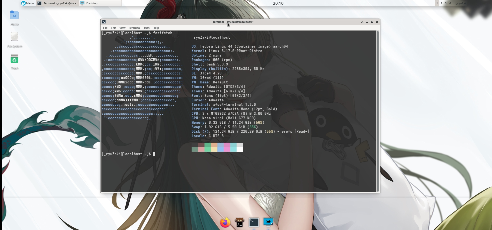
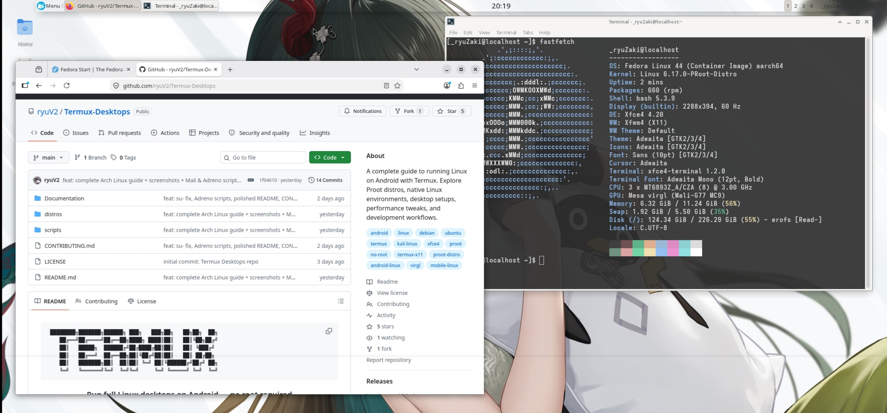
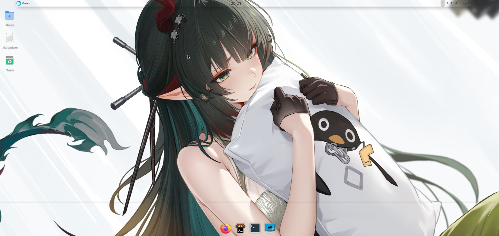

# Fedora 44 — proot Desktop

> Full XFCE4 desktop with VirGL hardware acceleration on Android — no root required.  
> Status: ✅ Complete · XFCE: **4.20**

---

## Preview

| fastfetch | Desktop + Browser | Desktop |
|---|---|---|
|  |  |  |

**Specs (tested on):**
- Device: OnePlus Nord 2 5G
- CPU: MT6893Z_A/CZA (8) @ 3.00 GHz
- GPU: Mesa virgl (Mali-G77 MC9)
- OS: Fedora Linux 44 (Container Image) aarch64
- Kernel: 6.17.0-PRooT-Distro
- Shell: bash 5.3.9 · DE: Xfce4 4.20 · WM: Xfwm4

---

## Requirements

- Termux (F-Droid or GitHub — NOT Play Store)
- Termux:X11 APK from GitHub releases
- ~3–4 GB free storage

---

## Step 1 — Termux Packages

**Mali / MediaTek / Exynos devices:**
```bash
pkg update && pkg upgrade -y
pkg install x11-repo termux-x11-nightly proot-distro pulseaudio virglrenderer-android
```

**Snapdragon / Adreno devices:**
```bash
pkg update && pkg upgrade -y
pkg install x11-repo termux-x11-nightly proot-distro pulseaudio \
  mesa-zink vulkan-loader-android virglrenderer-mesa-zink
```

---

## Step 2 — Install Fedora

```bash
proot-distro install fedora
```

Login as root:
```bash
proot-distro login fedora
```

---

## Step 3 — Initial Setup

```bash
dnf update -y
dnf install -y sudo passwd wget curl git nano
```

### Set root password
```bash
passwd
# set a password — needed for su - on desktop
```

### Create a non-root user
```bash
useradd -m -s /bin/bash YourUsername
echo "YourUsername:YourPassword" | chpasswd
usermod -aG wheel YourUsername
echo "%wheel ALL=(ALL) NOPASSWD:ALL" >> /etc/sudoers
```

> Replace `YourUsername` and `YourPassword` with your own.

---

## Step 4 — Install XFCE4 Desktop

> ⚠️ Fedora 44 doesn't support group installs like `@xfce-desktop` in proot. Install packages individually:

```bash
dnf install -y \
  xfce4-session xfce4-panel xfwm4 xfdesktop \
  xfce4-settings xfce4-terminal xfce4-appfinder \
  xfce4-notifyd xfce4-screenshooter \
  xfce4-whiskermenu-plugin \
  thunar thunar-archive-plugin \
  dbus-x11 pulseaudio pavucontrol \
  mesa-dri-drivers mesa-libGL
```

---

## Step 5 — Enable VirGL (Hardware Acceleration)

VirGL runs from Termux side — handled by the launch script. Verify after desktop starts:

```bash
glxinfo | grep "OpenGL renderer"
# Expected: virgl (Mali-G77) or similar
```

---

## Step 6 — Install Firefox

> ⚠️ `dnf install firefox` may fail on Fedora 44 in proot. Use this workaround:

```bash
dnf download firefox --repo=fedora --destdir=/tmp --nogpgcheck
rpm -i --nodeps --force /tmp/firefox*.rpm
```

Launch:
```bash
firefox &
```

---

## Step 7 — Install Fastfetch

```bash
dnf install -y fastfetch
```

---

## Step 8 — Launch Script

> ⚠️ Run in **Termux**, not inside proot. Exit proot first with `exit`.

### Mali / MediaTek / Exynos (VirGL)

```bash
wget https://raw.githubusercontent.com/DeadKnox/Termux-Desktops/main/scripts/startfedora.sh \
  -O ~/startfedora.sh
chmod +x ~/startfedora.sh
```

### Snapdragon / Adreno (Zink + Turnip)

```bash
wget https://raw.githubusercontent.com/DeadKnox/Termux-Desktops/main/scripts/startfedora-adreno.sh \
  -O ~/startfedora.sh
chmod +x ~/startfedora.sh
```

> **Adreno 6XX/7XX users:** Install Turnip inside proot first:
> ```bash
> wget https://github.com/K11MCH1/AdrenoToolsDrivers/releases/download/v24.1.0/mesa-vulkan-kgsl_24.1.0-devel-20240120_arm64.deb
> rpm -i --nodeps --force mesa-vulkan-kgsl_*.deb
> ```

**Edit your username:**
```bash
nano ~/startfedora.sh
# Replace YourUsername with your actual username
# Save: Ctrl+X → Y → Enter
```

**Launch:**
```bash
bash ~/startfedora.sh
```

---

## ⚠️ Installing Packages on Desktop

`sudo` doesn't work in proot. Use `su -` from the desktop terminal:

```bash
su -
# enter root password
dnf install whatever-you-need
exit
```

---

## GPU Support

| GPU | Method | Status |
|---|---|:---:|
| Mali (MediaTek / Exynos) | VirGL (virpipe) | ✅ Works |
| Adreno 6XX/7XX (Snapdragon) | Zink + Turnip | ✅ Works |
| Adreno (older) | VirGL fallback | ⚠️ May work |

---

## Troubleshooting

| Issue | Fix |
|---|---|
| `dnf install firefox` fails | Use `dnf download` + `rpm -i --nodeps` workaround above |
| `@xfce-desktop` group not found | Install XFCE packages individually as shown in Step 4 |
| Desktop not appearing | Make sure Termux:X11 app is open |
| `llvmpipe` instead of virgl | Start `virgl_test_server_android` before launching |
| `sudo` doesn't work | Use `su -` instead |
| Black screen | Kill and restart: `bash ~/startfedora.sh` |

---

<div align="right"><a href="../../README.md">← back to index</a></div>
