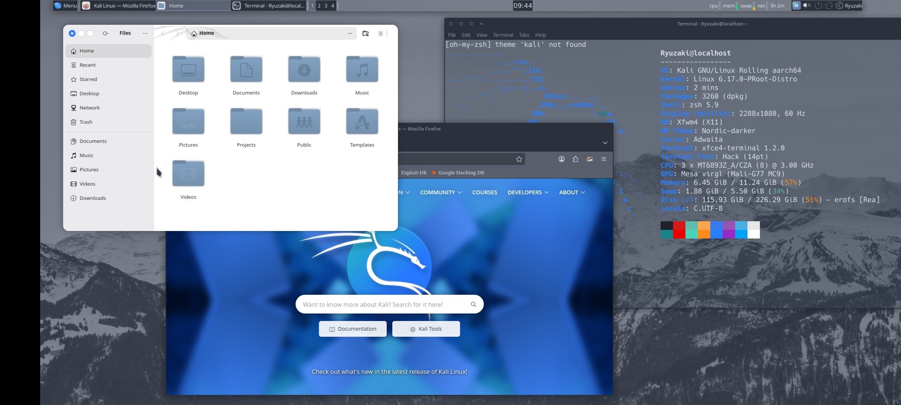
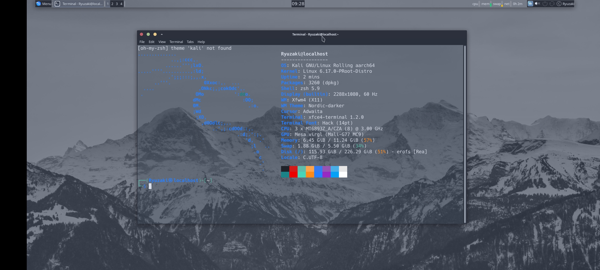

# Kali Linux (kali-rolling) — proot Desktop

> Full XFCE4 desktop with VirGL hardware acceleration on Android — no root required.  
> Status: ✅ Complete · glmark2: **63** · XFCE: **4.20**

---

## Preview

| Desktop + Firefox + Thunar | fastfetch |
|---|---|
|  |  |

**Specs (tested on):**
- Device: OnePlus Nord 2 5G
- CPU: MediaTek Dimensity 1200-AI (8 cores @ 3.00 GHz)
- GPU: Mesa virgl (Mali-G77 MC9)
- OS: Kali GNU/Linux Rolling aarch64
- Kernel: Linux 6.17.0-PRooT-Distro
- Shell: zsh 5.9 · WM: Xfwm4 · Theme: Nordic-darker

---

## Requirements

- Termux (from F-Droid or GitHub — NOT Play Store)
- Termux:X11 APK from GitHub releases
- ~3–4 GB free storage

---

## Step 1 — Termux Packages

```bash
pkg update && pkg upgrade -y
pkg install x11-repo termux-x11-nightly proot-distro pulseaudio virglrenderer
```

---

## Step 2 — Install Kali

```bash
proot-distro install kalilinux/kali-rolling:latest
```

Login as root:

```bash
proot-distro login kali-rolling --shared-tmp
```

---

## Step 3 — Install XFCE4

Inside Kali:

```bash
apt update && apt upgrade -y
apt install -y xfce4 xfce4-goodies dbus-x11 xfce4-terminal
```

> ⚠️ You will see systemd errors — this is normal in proot. XFCE will still install.

---

## Step 4 — Fix Broken dpkg (systemd issue)

Kali's packages depend on `systemd-sysusers` which doesn't work in proot. Fix it permanently:

```bash
for pkg in systemd-standalone-sysusers udev dbus-system-bus-common polkitd; do
  script="/var/lib/dpkg/info/${pkg}.postinst"
  if [ -f "$script" ]; then
    echo '#!/bin/sh' > "$script"
    echo 'exit 0' >> "$script"
  fi
done

dpkg --configure --force-all -a
```

> After this, `apt install` works without errors for all packages.

---

## Step 5 — Create a Non-Root User

```bash
useradd -m -s /bin/bash -G sudo YourUsername
echo "YourUsername:YourPassword" | chpasswd
echo "YourUsername ALL=(ALL) NOPASSWD:ALL" >> /etc/sudoers
```

Exit Kali:

```bash
exit
```

---

## Step 6 — Launch Script

> ⚠️ Run these commands in **Termux**, not inside proot. Exit proot first with `exit`.

**Download the script directly:**

```bash
wget https://raw.githubusercontent.com/ryuV2/Termux-Desktops/main/scripts/startkali.sh -O ~/startkali.sh
chmod +x ~/startkali.sh
```

**Edit your username:**

```bash
nano ~/startkali.sh
# Replace YourUsername with your actual username
# Save with Ctrl+X → Y → Enter
```

**Launch:**

```bash
bash ~/startkali.sh
```

---

## Step 7 — Verify VirGL

Inside Kali desktop, open terminal and run:

```bash
sudo apt install -y glmark2
glmark2
```

Expected output:
```
GL_RENDERER: virgl (Mali-G77 MC9)
glmark2 Score: 63
```

> If you see `llvmpipe` instead — make sure `virgl_test_server_android` is running before launching.

---

## Step 8 — Install Firefox ESR

```bash
sudo apt install -y firefox-esr
```

---

## Step 9 — Install Cybersecurity Tools

```bash
sudo apt install -y \
  nmap netcat-openbsd wireshark hydra sqlmap nikto \
  dirb gobuster john hashcat aircrack-ng \
  tor proxychains4 steghide binwalk foremost \
  ffuf wfuzz
```

Or use Kali metapackages:

```bash
sudo apt install -y kali-tools-top10        # essential 10
sudo apt install -y kali-tools-web          # web pentesting
sudo apt install -y kali-tools-wireless     # WiFi tools
sudo apt install -y kali-tools-forensics    # forensics
sudo apt install -y kali-tools-passwords    # password attacks
```

---

## GPU Support

| GPU | Status |
|---|:---:|
| Mali (MediaTek / Exynos) | ✅ Works great |
| Adreno (Snapdragon) | ✅ Works |
| PowerVR | ⚠️ Untested |

---

## Troubleshooting

| Issue | Fix |
|---|---|
| `dpkg returned error code (1)` | Run the postinst stub fix in Step 4 |
| `Failed to read 'basic.conf'` | Same fix as above |
| Desktop not appearing | Make sure Termux:X11 app is open |
| `llvmpipe` instead of virgl | Start `virgl_test_server_android` before launching |
| `sudo: command not found` | Login as root → `apt install -y sudo` |
| Black screen | Kill and restart: `bash ~/startkali.sh` |
| Font glitches | `sudo apt install fonts-hack` → set in terminal prefs |

---

## Benchmark

```
Device  : OnePlus Nord 2 5G
GPU     : Mali-G77 MC9
Driver  : Mesa virgl (GALLIUM_DRIVER=virpipe)

glmark2 score: 63
```

---

<div align="right"><a href="../../README.md">← back to index</a></div>
