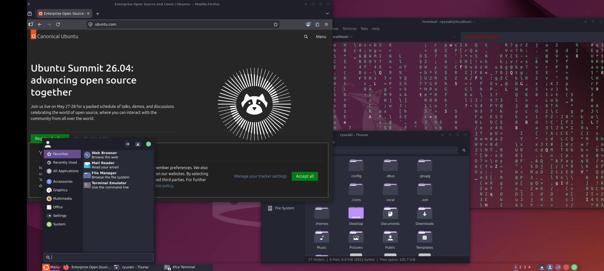
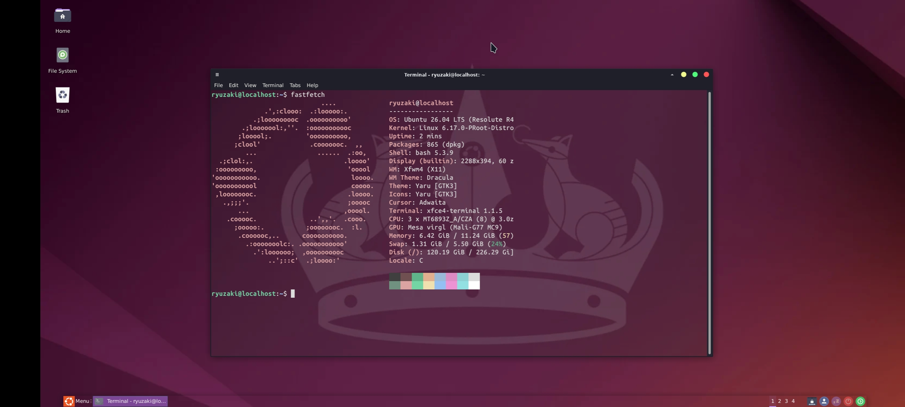

# Ubuntu 26.04 — proot Desktop

> Full XFCE4 desktop with VirGL hardware acceleration on Android — no root required.  
> Status: ✅ Complete · glmark2: **56** · XFCE: **4.20**

---

## Preview

| Desktop + Firefox + Whisker Menu | fastfetch |
|---|---|
|  |  |

**Specs (tested on):**
- Device: OnePlus Nord 2 5G
- CPU: MT6893Z_A/CZA (8) @ 3.00 GHz
- GPU: Mesa virgl (Mali-G77 MC9)
- OS: Ubuntu 26.04 LTS (Resolute R4)
- Kernel: 6.17.0-PRooT-Distro
- Shell: bash 5.3.9 · DE: Xfce4 4.20 · WM: Xfwm4
- Theme: Yaru · WM Theme: Dracula

---

## Requirements

- Termux (from F-Droid or GitHub — NOT Play Store)
- Termux:X11 APK from GitHub releases
- ~3–4 GB free storage

---

## Step 1 — Termux Packages

**Mali / MediaTek / Exynos devices:**
```bash
pkg update && pkg upgrade -y
pkg install x11-repo termux-x11-nightly proot-distro pulseaudio virglrenderer-android
```

**Snapdragon / Adreno devices:**
```bash
pkg update && pkg upgrade -y
pkg install x11-repo termux-x11-nightly proot-distro pulseaudio \
  mesa-zink vulkan-loader-android virglrenderer-mesa-zink
```

---

## Step 2 — Install Ubuntu

```bash
proot-distro install ubuntu
```

Login as root:

```bash
proot-distro login ubuntu
```

---

## Step 3 — Initial Setup

```bash
apt update && apt upgrade -y
apt install sudo adduser wget curl git nano -y
```

### Set a root password

> ⚠️ Important — you'll need this later to install packages from the desktop.

```bash
passwd
# enter a password you'll remember
```

### Create a non-root user

```bash
adduser YourUsername
usermod -aG sudo YourUsername
```

> Replace `YourUsername` with whatever username you want.

---

## Step 4 — Install XFCE4 + Apps

Still as root, install everything at once:

```bash
apt install -y \
  xfce4 xfce4-terminal xfce4-goodies \
  xfce4-whiskermenu-plugin \
  dbus-x11 pulseaudio pavucontrol \
  firefox \
  plank \
  mugshot \
  fastfetch \
  mesa-utils libgl1-mesa-dri
```

### Set up Plank autostart for your user

```bash
mkdir -p /home/YourUsername/.config/autostart
cp /usr/share/applications/plank.desktop /home/YourUsername/.config/autostart/
chown -R YourUsername:YourUsername /home/YourUsername/.config
```

---

## Step 5 — Enable VirGL (Hardware Acceleration)

The VirGL server runs from Termux before launching. It's handled in the launch script below.

Verify after desktop starts:

```bash
glxinfo | grep "OpenGL renderer"
# Expected: virgl (Mali-G77) or similar
```

---

## Step 6 — Launch Script

> ⚠️ Run in **Termux**, not inside proot. Exit proot first with `exit`.

### Mali / MediaTek / Exynos (VirGL)

```bash
wget https://raw.githubusercontent.com/DeadKnox/Termux-Desktopsmain/scripts/startubuntu.sh \
  -O ~/startubuntu.sh
chmod +x ~/startubuntu.sh
```

### Snapdragon / Adreno (Zink + Turnip)

```bash
wget https://raw.githubusercontent.com/DeadKnox/Termux-Desktopsmain/scripts/startubuntu-adreno.sh \
  -O ~/startubuntu.sh
chmod +x ~/startubuntu.sh
```

> **Adreno 6XX/7XX users (best performance):** Install the Turnip driver inside proot first:
> ```bash
> # Inside proot as root
> wget https://github.com/K11MCH1/AdrenoToolsDrivers/releases/download/v24.1.0/mesa-vulkan-kgsl_24.1.0-devel-20240120_arm64.deb
> dpkg -i mesa-vulkan-kgsl_*.deb
> ```

**Edit your username:**

```bash
nano ~/startubuntu.sh
# Replace YourUsername with your actual username
# Save: Ctrl+X → Y → Enter
```

**Launch:**

```bash
bash ~/startubuntu.sh
```

---

## ⚠️ sudo doesn't work in proot

This is an Android kernel restriction — `sudo` is blocked in all proot containers. You'll see this error:

```
sudo: The "no new privileges" flag is set, which prevents sudo from running as root.
```

**Fix — use `su -` instead:**

From the desktop terminal, whenever you need to install packages:

```bash
su -
# enter your root password
apt install whatever-you-need
exit
```

This switches you to root temporarily. Type `exit` when done to return to your user.

---

## GPU Support

| GPU | Status |
|---|:---:|
| Mali (MediaTek / Exynos) | ✅ Works great |
| Adreno (Snapdragon) | ✅ Works |
| PowerVR | ⚠️ Untested |

---

## Troubleshooting

| Issue | Fix |
|---|---|
| `sudo: no new privileges` | Use `su -` then `apt install` instead |
| Desktop not appearing | Make sure Termux:X11 app is open |
| `llvmpipe` instead of virgl | Start `virgl_test_server_android` before launching |
| Black screen | Kill and restart: `bash ~/startubuntu.sh` |
| Plank not showing | Run `plank &` from terminal, then add to autostart |

---

## Benchmark

```
Device  : OnePlus Nord 2 5G
GPU     : Mali-G77 MC9
Driver  : Mesa virgl (GALLIUM_DRIVER=virpipe)

glmark2 score: 56
```

---

<div align="right"><a href="../../README.md">← back to index</a></div>
